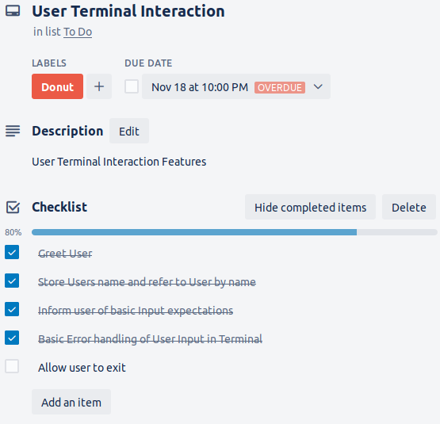
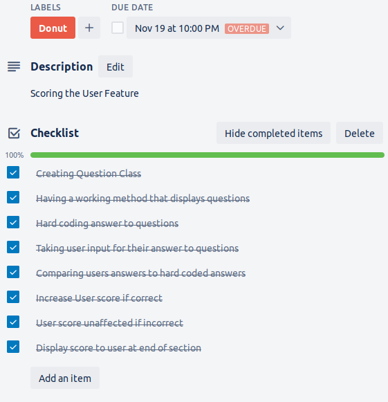
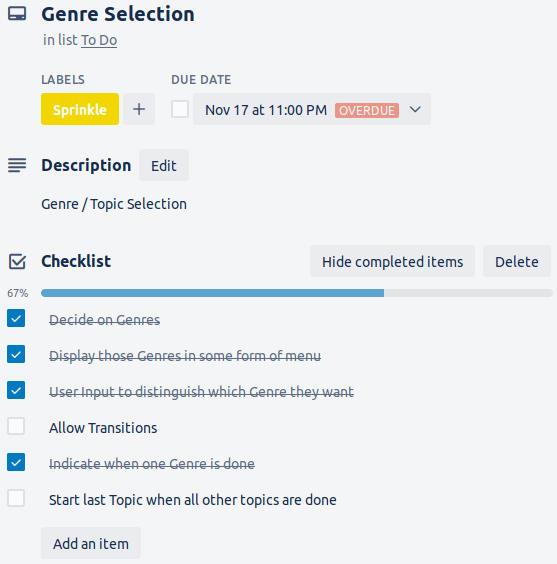

# Implementation Plan Quiz_T1A2

## 16th November - Dealing with User Terminal Interaction Feature

Need to come up with a plan to determine where within the App I'm expecting user input. Allows me to plan proper control flow hence allowing the user to direct the App towards their choices.

1) Greet the user on launch, asking for a name. (PRIORITY)
2) Store name into a variable and refer to the user by their name from now on.
3) Informing the user of expected input. Example 'a' 'b' 'c' or '1' '2' '3' (PRIORITY)
4) Basic error handling of User input
5) Allow user to exit App by inputing specific keys

## 18th November - Scoring User Feature

Main Test prototype should be up and running.

1) Creating a Question Class that allows me to hard code answers to questions (PRIORITY)
2) Recording User input for questions (PRIORITY) 
3) Comparing User Answer to Hard coded answer (PRIORITY)
4) Increasing score if values match 
5) Leave score unaffect if they dont match
6) Display the score to the user after each topic

## 20th November - Topic Selection Feature

Initial plan to write a method has proved unsuccessful. Time is running out so experimenting with a solution involving arrays.

1) Decide on what Topics are available for the quiz (PRIORITY)
2) Display those topics to user (PRIORITY)
3) User input to select topics (PRIORITY)
4) Allow transition from one Topic to another once a Topic is completed
5) Indicate when user has already completed a topic
6) Instantly start whatever topic is left last

